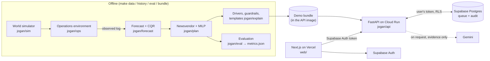

<p align="center"></p>

# Jogan · যোগান

**Agent liquidity copilot for mobile financial services (MFS) agents.** A student hackathon prototype for AI Dev Fest 2026 (DIU CPC × upay), Track 05: Merchant & Agent Intelligence.

> **All data in this project is simulated.** Jogan is an independent student prototype. It is not an upay product and uses no upay production data.

- **Live web app:** <https://jogan-bd.vercel.app> (one-click demo analyst or approver on the sign-in page)
- **Live API:** <https://jogan-api-gt7msysppq-as.a.run.app> (`/health`, `/health/db`, interactive docs at `/docs`)
- **Demo video:** <https://drive.google.com/file/d/1uXKkTAHMD9jE1exa-kO9ypYZwW8NukoK/view?usp=drive_link> (Google Drive)
- **Project report:** [`report/report.pdf`](report/report.pdf) (source: [`report/report.md`](report/report.md))

## Contents

[Overview](#overview) · [Results](#results) · [Features and how AI is used](#features-and-how-ai-is-used) · [Architecture](#architecture) · [Technology stack](#technology-stack) · [Requirements](#requirements) · [Installation and setup](#installation-and-setup) · [Environment variables](#environment-variables) · [Run and build](#run-and-build) · [Testing](#testing) · [Configuration](#configuration) · [Deployment](#deployment) · [Data and external sources](#data-and-external-sources) · [Responsible AI and security](#responsible-ai-and-security) · [Documentation](#documentation) · [Team](#team) · [AI usage](#ai-usage) · [License](#license)

## Overview

**Problem.** When an MFS agent's shop runs out of cash or e-float, the customer is turned away, and today nobody sees it coming.

An agent's shop holds two kinds of money: **physical cash** and **e-float** (the agent's digital balance). A cash-out drains cash and fills e-float; a cash-in does the reverse. When one side runs dry, the agent has a **stock-out**:

| Who | What goes wrong | What it costs |
|---|---|---|
| Customer | Comes to cash out a salary or a remittance and the drawer is empty | A wasted trip; tries another agent or another provider |
| Agent (shopkeeper) | Runs out of cash (cash-out) or e-float (cash-in) | The commission on every request turned away, and a trip to the bank to refill |
| Distributor and upay | Runners visit on a fixed round; a call comes only after the shop is already dry | Runner time and fuel spent on shops that did not need a visit while others wait; customers lost to other providers |

**How agents refill today.** Two channels, and neither looks ahead:

1. **The distributor's runner** visits the shop "usually at a predetermined time", and some distributors also come on a call. A survey of 2,800 Bangladeshi agents found that 96% rebalance this way ([ANA Bangladesh, 2014](https://www.microsave.net/wp-content/uploads/2014/11/Agent-Network-Accelerator-Bangladesh-Country-Report-2014.pdf)).
2. **The shopkeeper's own trip to a nearby bank.** It works only in bank transaction hours, 10:00 to 15:00 ([Bangladesh Bank, from 5 Apr 2026](https://www.dhakatribune.com/business/banks/406921/bb-reschedules-bank-transaction-hours)), and never on Friday, Saturday or a bank holiday. While the agent is away the shop is short-handed or shut, and the cash travels on the street. A drawer that runs dry on a Thursday evening stays dry until Sunday unless a runner comes. Jogan's simulator models this trip for every agent, under every policy, and counts it (below).

**How big it is.** Bangladesh Bank publishes what agents served each month, not how many customers they turned away. So we size the problem for a range of turned-away rates:

<!-- numbers:sizing -->
Agents served 52.0 crore cash-out and cash-in requests worth ৳89,672 crore in July 2026, across all MFS providers, about 280 a month per agent (1,856,190 agents, February 2025). Bangladesh Bank does not publish how many were turned away for lack of cash or e-float, so each row is a rate, not a measurement:

| Share of requests turned away | Customers turned away, July 2026 | Value turned away (৳) | Agent commission lost (৳) | Customers turned away, May 2026 (Eid-ul-Azha) | Value turned away (৳) |
|---|---|---|---|---|---|
| 1% | 52.5 lakh | 906 crore | 3.7 crore | 58.1 lakh | 1,028 crore |
| 2% | 106.1 lakh | 1,830 crore | 7.5 crore | 117.4 lakh | 2,077 crore |
| 5% | 273.7 lakh | 4,720 crore | 19.4 crore | 302.9 lakh | 5,356 crore |

1 lakh = 100,000; 1 crore = 10 million. Commission at ৳4.10 per ৳1,000 (`configs/ops/costs.yaml`). Assumptions: turned-away rates are a sensitivity, not a measurement; a turned-away request has the month's average size; published totals are served requests only (turned away = served * r / (1 - r)); a customer who comes back later is not netted out. Sources: Bangladesh Bank MFS table 9 and agent count (`configs/calibration/bb_mfs_2026.yaml`). Written by `make sizing` to `artifacts/sizing.json`.
<!-- /numbers -->

**How often, in our simulated network.** In the simulator we know every customer who was turned away, what they wanted and how often agents went to the bank themselves. Over the evaluation's test window, which includes Eid-ul-Azha:

<!-- numbers:problem -->
| Test window | Fixed round (status quo) | Threshold | Safety stock | **Jogan** |
|---|---|---|---|---|
| Requests turned away per 1,000 | 118.4 (115.9 to 120.9) | 111.1 (108.4 to 113.8) | 111.5 (108.7 to 114.3) | 108.9 (106.1 to 111.6) |
| Requests turned away | 19,376 (18,935 to 19,818) | 18,188 (17,707 to 18,668) | 18,246 (17,771 to 18,720) | 17,820 (17,338 to 18,300) |
| Agent-days with a customer turned away | 45.6% | 44.3% | 44.1% | 43.5% |
| Value turned away (৳) | 74,511,295 | 72,232,235 | 72,483,650 | 71,303,785 |
| of it cash-out (৳) | 37,666,940 | 35,760,725 | 36,084,595 | 34,633,215 |
| Agent commission lost (৳) | 305,496 | 296,152 | 297,183 | 292,346 |
| Agents' own bank trips | 1,134 (1,109 to 1,160) | 932 (905 to 959) | 930 (901 to 958) | 922 (894 to 950) |

Agents' own bank trips, Jogan minus each baseline, paired by seed: Fixed round (status quo) -212.6 (-232.1 to -193.1); Threshold -9.9 (-22.2 to 2.4); Safety stock -7.8 (-27.9 to 12.3). An agent goes to a bank only on a bank-open day and in bank hours (`configs/ops/env.yaml`), so a drawer that runs dry on a Friday, a Saturday, a holiday or after the bank closes stays dry until a runner comes.

_Evaluation on simulated data: profile `full`, 10 seeds (1000 to 1009), test window 2026-05-07 to 2026-06-03 (28 days), mean and 95% interval over seeds. Source: `artifacts/metrics.json`, written by `make eval`._
<!-- /numbers -->

**Measuring it on real data.** upay's ledger records the transactions that were served, not the customer who walked away. Step 0 of our validation plan measures the real rate from data upay already holds: the hours each agent sat with too little cash or e-float, times the demand expected in those hours (the same censoring correction Jogan's forecast trains on, D-020), checked against a short manual tally at a sample of agents. See [`docs/07-product-readiness.md`](docs/07-product-readiness.md) §5.

**Solution.** Jogan is a morning copilot for the distributor's liquidity desk, in three steps:

1. **Predict.** For every agent, the chance of running out of cash or e-float in the next 6, 12 and 24 hours, from a calibrated forecast of the **peak drain**.
2. **Plan.** Which shops each runner should visit today, in what order and with how much, weighing a customer turned away against runner time, fuel and idle money (newsvendor need + an optimizer per territory).
3. **Approve.** A manager approves or rejects each visit, with the reason in English and Bangla. Uncertain cases go to manual review, and every decision lands in an append-only audit log. The AI explains; it never decides.

**Purpose.** Fewer customers turned away for the same or less runner effort, with every recommendation traceable to its data, model and config version. The whole chain is measured in a simulated operations environment against three simple policies over several seeds, and the losing cases are reported next to the wins.

## Results

Jogan against the status quo and two stronger rule-based policies on the held-out test window. Every number below is written by `make docs` from `artifacts/metrics.json`; none is typed by hand.

<!-- numbers:headline -->
| Policy | Lost requests per 1,000 | Lost requests | Runner km | Known cost (৳) |
|---|---|---|---|---|
| Fixed round (status quo) | 118.4 (115.9 to 120.9) | 19,376 (18,935 to 19,818) | 41,861 (41,689 to 42,034) | 713,522 (708,066 to 718,979) |
| Threshold | 111.1 (108.4 to 113.8) | 18,188 (17,707 to 18,668) | 41,848 (41,426 to 42,270) | 699,550 (693,828 to 705,273) |
| Safety stock | 111.5 (108.7 to 114.3) | 18,246 (17,771 to 18,720) | 41,481 (41,123 to 41,839) | 706,256 (699,882 to 712,631) |
| **Jogan** | 108.9 (106.1 to 111.6) | 17,820 (17,338 to 18,300) | 40,194 (39,776 to 40,612) | 693,700 (687,341 to 700,058) |
| Oracle (perfect foresight, not deployable) | 89.0 (86.4 to 91.5) | 14,565 (14,094 to 15,035) | 43,496 (43,126 to 43,867) | 658,728 (652,808 to 664,648) |

Jogan minus each baseline, paired by seed (negative means Jogan is lower):

| Baseline | Lost per 1,000 | Runner km | Known cost (৳) | Break-even |
|---|---|---|---|---|
| Fixed round (status quo) | -9.51 (-10.07 to -8.96) | -1,667 (-2,001 to -1,334) | -19,823 (-22,859 to -16,787) | Jogan cheaper at every value of a lost customer |
| Threshold | -2.25 (-2.69 to -1.81) | -1,654 (-1,883 to -1,425) | -5,851 (-7,463 to -4,238) | Jogan cheaper at every value of a lost customer |
| Safety stock | -2.61 (-3.15 to -2.06) | -1,287 (-1,426 to -1,148) | -12,557 (-14,071 to -11,043) | Jogan cheaper at every value of a lost customer |

In the Eid-ul-Azha window (2026-05-18 to 2026-05-31), Jogan minus the best baseline (Threshold): -1.94 (-2.43 to -1.44) lost requests per 1,000.

Known cost is runner time and fuel, lost commission and idle liquidity at the middle runner salary (`configs/ops/costs.yaml`); Jogan runs at a lost-customer value of ৳20. The oracle sees the future and only marks how much room is left.

_Evaluation on simulated data: profile `full`, 10 seeds (1000 to 1009), test window 2026-05-07 to 2026-06-03 (28 days), mean and 95% interval over seeds. Source: `artifacts/metrics.json`, written by `make eval`._
<!-- /numbers -->

**Where Jogan does not win** (details in [`docs/05-evaluation.md`](docs/05-evaluation.md)):

<!-- numbers:limits -->
- **Some groups are served worse than by the best baseline (Threshold).** Lost requests per 1,000, Jogan minus Threshold: `urban` and `DHK` (the same agents) 1.03 (0.01 to 2.06).
- **Forecast intervals are off their nominal coverage by more than 5 points in 45 cells** (by side, horizon, interval and agent group), 4 of them over all agents.
- **The oracle is still ahead:** Jogan minus the oracle, 19.9 (19.1 to 20.7) lost requests per 1,000.
- **The anomaly flag is weak on structuring:** split cash-outs found in 1 of 9 injected windows; precision 3.9% against a base rate of 0.08%.
- **62 group-level comparisons** (across lost-customer values and baselines) show no significant win or a baseline as good or better (`does_not_win` in `artifacts/metrics.json`).
<!-- /numbers -->

**Scale check** (`make stress`, D-026):

<!-- numbers:stress -->
| Measure | Mean | Max |
|---|---|---|
| One morning, end to end (s) | 3.1 | 4.3 |
| Plan (s) | 2.4 | 3.5 |
| of which MILP solver (s) | 1.7 | 2.8 |
| Drivers, guardrails, flags (s) | 0.7 | 0.8 |

10,000 agents, 260 runners, 60 territories; 7 Jogan mornings after 7 days of status quo. 360 programs, 0 fallbacks, 23,836 visits; peak memory 1,779 MB; whole run 101 s.

_Timing only, on 13th Gen Intel(R) Core(TM) i7-13650HX (20 threads). Source: `artifacts/stress.json`, written by `make stress`._
<!-- /numbers -->

The impact page of the web app (<https://jogan-bd.vercel.app/impact>) shows the same evaluation with fairness by group, forecast calibration, the anomaly flag and the ablations.

## Features and how AI is used

| Feature | What the user sees | Technique | AI or rules? |
|---|---|---|---|
| Peak-drain forecast | Stock-out chance per agent and side, forecast drain (median, 90%, 99%) against the balance | LightGBM quantile regression per horizon and quantile, conformalized (CQR); censoring-aware labels | ML, trained in this repo |
| Visit plan | Each morning's runner visits with amount and side | Newsvendor need per agent, then a mixed-integer program per territory (SciPy `milp`, HiGHS) with a greedy fallback | Optimization |
| Drivers | Top reasons per visit as diverging bars | TreeSHAP (LightGBM `pred_contrib`) on the 0.9-quantile, 24-hour model of the side at risk | ML attribution |
| Explanation of record | "Why?" text in English and Bangla (Bangla digits, lakh grouping, ৳) | Template filled from the stored evidence only | Rules |
| AI rewording (optional) | "Reword with AI", labelled with the model id | Gemini `gemini-3.5-flash-lite`, falling back to `gemini-3.1-flash-lite`; discarded if it adds a number or drops the stock-out chance | LLM, explains only |
| Guardrails | "⚑ Manual review" tag; approving needs a note | Out of training range, wide interval, data gap, short history, anomaly flag | Rules |
| Anomaly flag | Advisory flags per morning | Isolation Forest per agent setting plus two rules | ML, advisory |
| Approval and audit | Approve / reject per visit, audit log, 8-step decision trace | Supabase RLS, transactional decision + audit row, append-only triggers | Human decides |
| Network map and impact | Map of agents by risk band (shape and ring, not colour alone), 28-day timeline, impact page | MapLibre GL JS on OpenFreeMap tiles | — |

The LLM never decides and never produces a number: it may only reword a template that was built from structured evidence, and the template stays the default. See [`docs/06-responsible-ai.md`](docs/06-responsible-ai.md).

## Architecture



Data preparation, model inference, business rules and the LLM are separate modules; every layer of a recommendation names the config hash it ran under. Details in [`docs/03-architecture.md`](docs/03-architecture.md).

## Technology stack

| Layer | Choice |
|---|---|
| Languages | Python 3.12, TypeScript, SQL (PostgreSQL 17) |
| Data and ML | NumPy, pandas, PyArrow, LightGBM (quantile regression, TreeSHAP), scikit-learn (Isolation Forest), SciPy (`milp` with HiGHS) |
| AI model (run time) | Google Gemini via Google AI Studio (free tier): `gemini-3.5-flash-lite`, fallback `gemini-3.1-flash-lite`, set in `configs/explain/base.yaml` |
| API | FastAPI, Uvicorn, pydantic, PyJWT (ES256/RS256 against Supabase's JWK set), httpx |
| Web | Next.js 16 (App Router), React 19, Tailwind CSS 4, supabase-js, MapLibre GL JS with OpenFreeMap tiles, lucide-react icons, Noto Sans Bengali |
| Database and auth | Supabase (Postgres, Auth, row-level security), migrations in `supabase/migrations/` |
| Hosting | Google Cloud Run (API, Docker, Singapore), Vercel (web), Supabase (Singapore) |
| Tooling | uv, ruff, pytest, pre-commit, gitleaks, GitHub Actions (CI, deploy, keep-alive, secret scan), Dependabot, Docker |

Exact versions are pinned in [`uv.lock`](uv.lock) and [`web/package-lock.json`](web/package-lock.json); `artifacts/metrics.json` records the library versions that produced the results.

## Requirements

- Linux or macOS, `git`, GNU `make`, `curl`, [`uv`](https://docs.astral.sh/uv/) (it installs Python 3.12 itself)
- Node.js 22 and npm for the web app
- Docker, only for `make test-db` (a throwaway Postgres 17) and for building the API image
- For a full deployment of your own: a Supabase project, a Google AI Studio key, a Google Cloud project with billing, a Vercel account

Hardware: the tests and the `tiny` and `dev` profiles are light. The heavy commands, as last run:

<!-- numbers:runtime -->
`make eval` took 24 min for 10 seeds (`meta.runtime_s`). `make stress` took 101 s at a peak of 1,779 MB on 13th Gen Intel(R) Core(TM) i7-13650HX (20 threads, 15 GB RAM).
<!-- /numbers -->

## Installation and setup

```bash
git clone https://github.com/imshaid/Jogan.git
cd Jogan
make setup                       # Python deps with uv, git hooks
make check                       # lint + tests, same as CI
make run                         # API on :8000 + web app on :3000, no accounts needed
```

Then open <http://localhost:3000> and sign in under **Local run** as analyst or approver. The first `make run` builds the deployed demo world into `bundle/` (profile `full`, seed 42, about 80 s) and installs the web app's packages; later runs start in seconds. Ctrl+C stops both servers.

`make run` needs no Supabase or Gemini account: the API keeps decisions and the audit log in memory (`JOGAN_STORE=memory`, refused outside `JOGAN_ENV=development`) and takes the role names `analyst` and `approver` as bearer tokens, and the web app offers those two roles instead of a password form (`NEXT_PUBLIC_LOCAL_AUTH=1`, honoured only for an API on `localhost`). Without `GEMINI_API_KEY`, "Reword with AI" answers with the template and says why; to try it locally, run `GEMINI_API_KEY=<your key> make run`. For a smaller, faster world, run `make bundle PROFILE=tiny SEED=0` first.

## Environment variables

All names are in [`.env.example`](.env.example) with placeholders. The API reads the process environment: `make run` and `make api` set the local values themselves, Cloud Run gets them from the deploy workflow and Secret Manager, and a `.env` copy of `.env.example` is read only where a command says so (`scripts/gcp-setup.sh`, `uv run --env-file .env …`). The web app reads `web/.env.local` locally and the Vercel project settings in production. Never commit `.env` or `web/.env.local`.

| Name | Where | Purpose |
|---|---|---|
| `JOGAN_ENV` | API | `development` or `production` |
| `JOGAN_PROFILE`, `JOGAN_SEED` | scripts | Simulation profile (`tiny`, `dev`, `full`, `stress`) and seed |
| `JOGAN_CORS_ORIGINS` | API | Comma-separated exact origins allowed to call the API |
| `JOGAN_CORS_ORIGIN_REGEX` | API | Optional origin pattern (e.g. Vercel previews); unset in production |
| `JOGAN_BUNDLE_DIR` | API | The served bundle (`make bundle`); `/app/bundle` in the image |
| `JOGAN_STORE` | API | `supabase` or `memory` (development only) |
| `JOGAN_TRUSTED_PROXY_HOPS` | API | Proxies in front of the API (0 locally, 1 on Cloud Run) |
| `JOGAN_DEMO_PASSWORD` | `scripts/seed_demo_users.py` | Password for the two demo users |
| `SUPABASE_URL` | API | Supabase project URL |
| `SUPABASE_PUBLISHABLE_KEY` | API | Browser-safe key; RLS applies |
| `SUPABASE_SECRET_KEY` | API (server only) | Publishes plans and serves `/health/db`; never in the web app |
| `GEMINI_API_KEY` | API | Google AI Studio key (free tier, no billing) |
| `GEMINI_MODEL_PRIMARY`, `GEMINI_MODEL_FALLBACK` | API | Optional overrides of the model ids in `configs/explain/base.yaml` |
| `NEXT_PUBLIC_API_BASE_URL` | web | The API URL (`http://localhost:8000` locally) |
| `NEXT_PUBLIC_SUPABASE_URL`, `NEXT_PUBLIC_SUPABASE_PUBLISHABLE_KEY` | web | Supabase Auth in the browser |
| `NEXT_PUBLIC_MAP_STYLE_URL` | web | Optional MapLibre style; default OpenFreeMap `positron`, no key |
| `NEXT_PUBLIC_DEMO_PASSWORD` | web | Optional one-click demo sign-in (public by design, D-022) |
| `NEXT_PUBLIC_LOCAL_AUTH` | web | `1` on a local run only (`make run` sets it): sign in as analyst or approver without Supabase, against an API on `localhost` |

## Run and build

```bash
make data PROFILE=dev SEED=0       # simulated world → data/dev/seed0/
make history PROFILE=dev SEED=0    # status-quo operations log
make baselines PROFILE=dev SEED=0  # three baselines + oracle on one world
make forecast PROFILE=dev SEED=0   # forecast backtest
make eval                          # final comparison, seeds 1000–1009 → artifacts/metrics.json
make sizing                        # problem size from Bangladesh Bank figures → artifacts/sizing.json
make impact                        # impact page numbers → web/lib/impact.json
make docs                          # numbers in README and docs ← artifacts
make stress                        # 10,000-agent timing → artifacts/stress.json
make bundle PROFILE=tiny SEED=0    # served bundle → bundle/ (deployed: PROFILE=full SEED=42)
make run                           # API + web app locally, no accounts (builds bundle/ if missing)
make api                           # API alone on :8000, in-memory store, auto-reload (after make bundle)
cd web && npm run dev              # web app alone on :3000 (NEXT_PUBLIC_* in web/.env.local)
cd web && npm run build            # production build of the web app
docker build -t jogan-api .        # API image; builds the full demo bundle inside
make help                          # every target
```

To run the two halves separately, put the `NEXT_PUBLIC_*` values in `web/.env.local`: with `make api`, `NEXT_PUBLIC_API_BASE_URL=http://localhost:8000` and `NEXT_PUBLIC_LOCAL_AUTH=1`; with an API on your own Supabase project, the two `NEXT_PUBLIC_SUPABASE_*` values instead. The deployed API answers only the production web origin (CORS), so a local web app cannot use it.

## Testing

```bash
make check                   # ruff lint and format check, then pytest (same as CI)
make test                    # pytest only
make test-db                 # migrations, RLS, grants and append-only audit on Postgres 17 (Docker)
make run                     # then sign in at http://localhost:3000 and approve a visit by hand
cd web && npm run lint && npm run typecheck && npm run build
uv run --with playwright python scripts/live_check.py   # end-to-end on the live site (decides 2 visits)
```

The Python tests cover the simulator's patterns, the environment, the baselines, forecast leakage and calibration, the planner, explanations and guardrails, the anomaly flag, the API (auth with real signed tokens, forged tokens, roles, rate limits, validation, trace) and that the committed impact page and docs numbers match `artifacts/metrics.json`. Gemini is mocked in tests and CI.

## Configuration

Every tunable number lives in YAML under [`configs/`](configs/), loaded by typed pydantic models that reject unknown keys; each number is tagged `ASSUMPTION`, `DERIVED` or with its source, and tests enforce the tags. A config hash is stored with every result and every recommendation.

| Folder | What it sets |
|---|---|
| `configs/sim/` | World size and demand patterns per profile (`tiny`, `dev`, `full`, `stress`) |
| `configs/calendar/`, `configs/geo/`, `configs/calibration/` | 2026 Bangladesh calendar, territories and hubs, Bangladesh Bank MFS calibration targets |
| `configs/ops/` | Runners, shifts, costs (three salary levels), baseline policies |
| `configs/forecast/`, `configs/plan/` | Features, quantiles, CQR; newsvendor and MILP settings |
| `configs/explain/` | Drivers, guardrail thresholds, Gemini models and limits, English/Bangla labels |
| `configs/eval/` | Seeds, windows, lost-customer values; stress world |
| `configs/api/` | Rate limits, body cap, token checks |

## Deployment

- **API:** `.github/workflows/deploy-api.yml` builds the Docker image, pushes it to Artifact Registry and deploys to Cloud Run (Singapore) after CI passes on `main`, with keyless Workload Identity Federation. Secrets come from Secret Manager. One-time setup: [`scripts/gcp-setup.sh`](scripts/gcp-setup.sh).
- **Web:** Vercel deploys `web/` on every push to `main`.
- **Database:** `supabase/migrations/` (pushed with the Supabase CLI); demo users from `scripts/seed_demo_users.py`; public sign-up is off.
- **Monitoring:** `GET`/`HEAD /health` and `/health/db` for an uptime monitor; `.github/workflows/keepalive.yml` pings the database every 6 hours so the free Supabase project does not pause.

Step by step in [`docs/09-deployment.md`](docs/09-deployment.md).

## Data and external sources

All agent, customer and transaction data is **simulated** by `jogan/sim`. Public facts used to shape the simulation (each cited in [`docs/02-data-assumptions.md`](docs/02-data-assumptions.md)):

- Bangladesh Bank MFS statistics (accounts, agents, agent cash-in/out by month)
- the 2026 public holiday list and the actual Eid dates; the Friday–Saturday bank weekend; Labour Act wage timing
- top remittance districts (March 2026)
- district coordinates from [nuhil/bangladesh-geocode](https://github.com/nuhil/bangladesh-geocode) (MIT)
- fuel prices, motorcycle running costs, distribution officer salaries and the policy rate, for the cost model

External services at run time: Supabase (auth, database), Google AI Studio (Gemini, optional rewording, synthetic data only), OpenFreeMap (map tiles), Google Cloud Run, Vercel, GitHub Actions, UptimeRobot.

## Responsible AI and security

- Synthetic data only; nothing personal is stored. The "Simulated data" badge is always visible.
- A human approves or rejects every visit; approving a flagged visit needs a note. Decisions and audit rows are written in one transaction, and the audit log is append-only even for the table owner.
- Roles (analyst, approver) are enforced twice: by the API, which verifies every Supabase token, and by row-level security in Postgres.
- Rate limits per address, per user, for decisions and for AI rewording; body size cap; strict input validation; uniform error bodies.
- The LLM receives only structured evidence, never user text, and its output is discarded if it adds a number, drops the stock-out chance, uses the wrong script or runs too long.
- Every output is labelled as a prediction, a template, AI-written, an assumption or an evaluation; risk is never shown by colour alone.
- Fairness by territory, setting and agent size is measured and reported, including where Jogan is worse.

Details in [`docs/06-responsible-ai.md`](docs/06-responsible-ai.md).

## Documentation

| Doc | About |
|---|---|
| [`00-requirements-checklist`](docs/00-requirements-checklist.md) | Every official requirement and where it is met |
| [`01-logic-chain`](docs/01-logic-chain.md) | Problem → decision → action → value, on one page |
| [`02-data-assumptions`](docs/02-data-assumptions.md) | The simulated world and every assumption, with sources |
| [`03-architecture`](docs/03-architecture.md) | Components, data flow, separation of concerns |
| [`04-model-card`](docs/04-model-card.md) | Forecast, calibration, drivers, anomaly flag |
| [`05-evaluation`](docs/05-evaluation.md) | Method, results, fairness, losing cases |
| [`06-responsible-ai`](docs/06-responsible-ai.md) | Privacy, explainability, fairness, security, oversight |
| [`07-product-readiness`](docs/07-product-readiness.md) | Workflow fit, validation with real data, integration |
| [`08-ai-usage`](docs/08-ai-usage.md) | AI tools used to build Jogan and AI inside it |
| [`09-deployment`](docs/09-deployment.md) | How the live system is deployed and monitored |
| [`10-demo-script`](docs/10-demo-script.md) | The demo video script |
| [`DECISIONS`](docs/DECISIONS.md) | Decision log with reasons |
| [`STATUS`](docs/STATUS.md) | Progress and how to run things |

## Team

Team Adrenaline, Department of Computer Science and Engineering, Daffodil International University:

- Md. Shaid Hasan (241-15-360), team leader
- Md. Fazle Rabbi (241-15-364)
- Md. Afsahul Arefin Talukder (241-15-377)

The project report is [`report/report.md`](report/report.md), also as a PDF: [`report/report.pdf`](report/report.pdf).

## AI usage

Jogan was built with Claude Code (Claude Opus 5.5) under the team's review; commits made with it carry a co-author trailer. Inside the product, Gemini only rewords explanations. Full disclosure in [`docs/08-ai-usage.md`](docs/08-ai-usage.md).

## License

[MIT](LICENSE). The upay name is used only to name the competition; no upay logo or asset is used.
