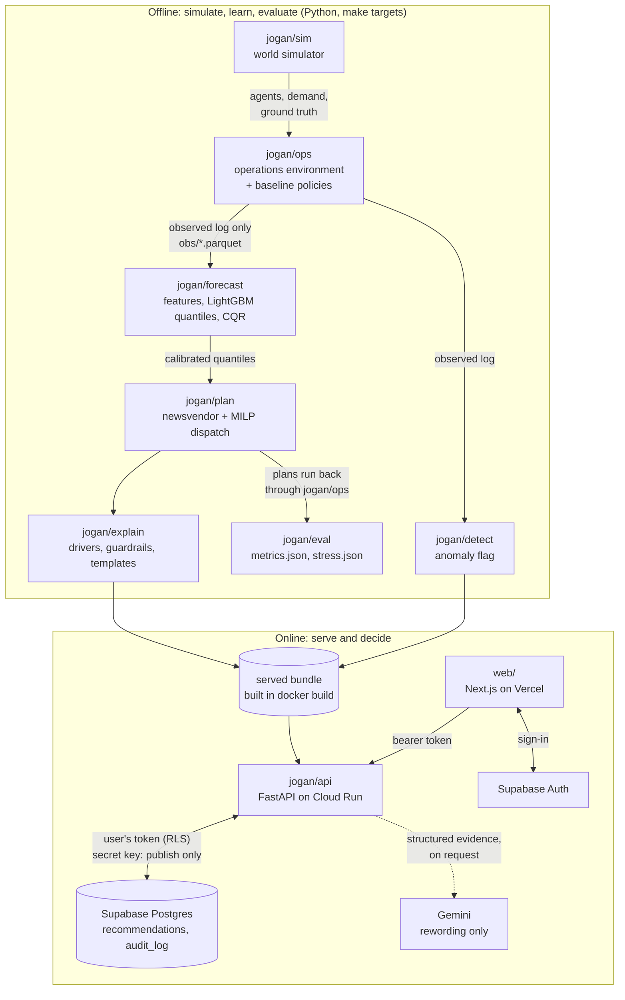

# Architecture

How Jogan is built: the components, the data that flows between them, where machine learning stops and business rules start, and how the live system is served. Written so that every teammate can explain any box in the picture. Decisions behind each choice are in [`DECISIONS.md`](DECISIONS.md) (cited as D-0xx).

## 1. The picture



The offline half produces two things: the evaluation artifacts (`artifacts/metrics.json`, `artifacts/stress.json`) and, inside the Docker build, the **served bundle**: one demo world with every morning's plan and evidence. The online half never simulates or trains; it serves that bundle, records human decisions and explains.

## 2. Components

| Module | Responsibility | Reads | Writes | Kind |
|---|---|---|---|---|
| `jogan/sim` | Seeded synthetic world: territories, agents, runners, customers, calendar effects, injected anomalies; calibrated to Bangladesh Bank aggregates | `configs/sim`, `calendar`, `geo`, `calibration` | `data/<profile>/seed<n>/` (public and truth files, D-014) | Simulation |
| `jogan/ops` | Event-replay environment: every customer attempt meets the agent's exact cash or e-float; runners, calls, bank trips; baseline policies and the oracle; cost model | world, a policy | observed log `obs/`, truth `truth/`, summary | Simulation + rules |
| `jogan/forecast` | Features at each origin from records already available, peak-drain targets, censoring handling, LightGBM quantile models, asymmetric CQR, backtest | observed log only | quantile forecasts, scores | ML |
| `jogan/plan` | Newsvendor need per side, value of a visit, one mixed-integer program per territory (HiGHS), greedy fallback | forecasts, balances, fleet, costs | the morning's visits with amount, side and evidence | Business rules + optimization |
| `jogan/explain` | TreeSHAP drivers, guardrails (manual review), English/Bangla templates, Gemini narrator | evidence of one visit | drivers, review reasons, explanation text | ML attribution, rules, LLM (wording only) |
| `jogan/detect` | Advisory anomaly flag per agent-day | observed log | flags with reasons | ML + rules |
| `jogan/eval` | Multi-seed comparison, paired intervals, break-even, fairness, hypotheses, stress timing, copies for the web and docs | all of the above | `artifacts/*.json`, `web/lib/impact.json`, numbers in docs | Evaluation |
| `jogan/api` | Auth, guards, queue, decisions, audit, trace, network and agent views | bundle, Supabase | HTTP responses, rows via SQL functions | Serving |
| `supabase/` | Tables, row-level security, SQL functions, append-only triggers | — | — | Database |
| `web/` | Map, queue, agent detail, impact, audit, about; English and Bangla | API, Supabase Auth | — | UI |

## 3. One morning, step by step

At 08:00 on each plan day (before the 09:00 runner shift) Jogan runs the same code in the evaluation, the stress check and the served bundle. The decision trace (`GET /v1/recommendations/{id}/trace`) shows these steps for every visit, each with who produced it and the config hash it ran under:

| # | Step | Who | What happens |
|---|---|---|---|
| 1 | `forecast` | model | Features from the observed log up to 08:00 (each record carries `available_at`); LightGBM predicts quantiles of the **peak** cumulative drain of cash and e-float over 6, 12 and 24 hours; CQR widens or narrows each side of the interval so it covers as promised |
| 2 | `stock_out_chance` | model | P(peak drain > current balance), read from the calibrated quantiles (D-002 #3) |
| 3 | `drivers` | model explanation | TreeSHAP contributions of the 24-hour 0.9-quantile model of the side at risk; top effects kept |
| 4 | `need_and_value` | rule | Newsvendor need per side at the critical ratio from config costs; target level; value of a visit = shortage cost avoided + the call trip saved |
| 5 | `dispatch` | optimizer | One program per territory picks visits and runners to maximise value minus fuel and runner time, within visit and shift limits; a route check, a fill step, and the greedy round if the program fails |
| 6 | `guardrails` | rule | Manual review if the agent is outside the training range, the interval is wide, data is missing, history is short or the anomaly flag is on |
| 7 | `explanation` | template | English and Bangla text built only from the stored evidence |
| 8 | `decision` | human | An approver approves or rejects; a flagged visit needs a note; the decision and its audit row are written in one transaction |

Gemini is not a step. On request it may reword step 7's text; the rewording is discarded if it adds a number, drops the stock-out chance, uses the wrong script or is too long (D-023).

## 4. Separation of concerns

The organizers' guideline asks for five separations. Where each one lives:

- **Data preparation is separate from model inference.** `jogan/forecast/panel.py` turns the observed log into an agents × hours panel and refuses any column outside the log's schema; `features.py` builds features only from records whose `available_at` is before the forecast origin (a test checks there is no leak); `model.py` only fits and predicts.
- **Business rules are separate from ML predictions.** The model outputs quantiles. The decision to visit, the amount and the runner come from `jogan/plan`, driven by costs in `configs/ops/costs.yaml` and `configs/plan/base.yaml`, which an operator can change without retraining. Guardrails are rules in `jogan/explain/guardrails.py`.
- **Outputs are traceable and explainable.** Every visit keeps its evidence (balances, quantiles, stock-out chance, need, value, drivers, review reasons) and the config hashes of every layer; the trace and the audit log are served by the API.
- **The API is ready for a real backend.** Storage sits behind the `Store` protocol (`jogan/api/store.py`), with a Supabase implementation and an in-memory one with the same rules. The forecast reads one documented table (below), so a real transaction feed only has to produce that table.
- **No sensitive decision logic in a free-form LLM prompt.** The LLM sees one template and its evidence as JSON, never user text, and its output is checked before use. It cannot change a plan, a number or a decision.

## 5. Data contracts

**Observed log** (`obs/hourly.parquet`, the only training input; D-018). One row per agent-hour that reached upay's systems:

| Column | Meaning |
|---|---|
| `agent_id`, `ts` | agent and hour |
| `co_n`, `co_tk` | served cash-outs: count and amount |
| `ci_n`, `ci_tk` | served cash-ins: count and amount |
| `efloat_tk` | e-float balance at the end of the hour (exact, upay's ledger) |
| `cash_est_tk` | cash estimate at the end of the hour |
| `available_at` | when the record became usable; late and missing records are part of the simulation |

Visits, the agents' own bank trips (seen as e-float transfers) and runner days are logged next to it. `truth/` holds every request, including the ones lost to a stock-out, and is read only by evaluation code.

**Recommendation** (one row in `recommendations`): bundle id, plan date, agent, territory, runner, action (`visit`), target cash level, value of the visit, the evidence JSON (cash and e-float balances, stock-out chance per side, drain quantiles 0.5/0.9/0.99 per side, needs, the side at risk, drivers, review reasons; the explanations are built from it), the trace JSON (each layer's config hash), status (`pending`, `approved`, `rejected`), decided by, decided at, and a note of at most 500 characters.

**Audit row** (`audit_log`): time, actor (empty for the system publishing a plan), actor role, action (`plan.published`, `recommendation.approved`, `recommendation.rejected`), recommendation id, and details (including `manual_review` and the note). Append-only.

## 6. Serving

- **Served bundle** (`jogan/api/bundle.py`, D-022). Built during `docker build`: the `full` world with seed 42 (outside the development and evaluation seeds), the status quo, the forecaster trained on its log as in `make eval`, then Jogan on every test-window morning with all evidence kept. No model or data file is committed (D-002 #7). The bundle id comes from the config hashes, so the same commit gives the same id. The bundle is a replay: an approval is recorded, but it does not change the simulated world.
- **API** (`jogan/api/app.py`). Stateless apart from caches (JWK set, rate-limit buckets, Gemini rewordings, the `/health/db` answer), so Cloud Run can run several instances.

| Route | Who | What |
|---|---|---|
| `GET/HEAD /health`, `/health/db` | anyone | liveness; one database query, cached 60 s |
| `GET /v1/meta` | anyone | bundle id, plan days with counts |
| `GET /v1/me` | any signed-in user | user id and role (none for a user without one) |
| `GET /v1/plans/{day}` | analyst, approver | the day's queue (publishes the day on first request) |
| `GET /v1/network/{day}` | analyst, approver | every agent's risk and planned visit, for the map |
| `GET /v1/agents/{id}` | analyst, approver | one agent's days, forecasts, visits and flags |
| `GET /v1/anomalies/{day}` | analyst, approver | advisory flags |
| `GET /v1/recommendations/{id}/explanation?lang=en\|bn` | analyst, approver | Gemini's rewording or the template, with the reason |
| `GET /v1/recommendations/{id}/trace` | analyst, approver | the 8-step decision trace and audit rows |
| `POST /v1/recommendations/{id}/decision` | approver | approve or reject (note required for a flagged visit) |
| `GET /v1/audit` | analyst, approver | the audit log, optionally for one recommendation |

The impact page reads `web/lib/impact.json` (a copy of `artifacts/metrics.json`) and needs no API call.

- **Database** (`supabase/migrations/`). Tables `user_roles`, `recommendations`, `audit_log`, each with RLS and explicit grants. Users only read. Writes go through two functions: `publish_plan` (secret key only, once per day under an advisory lock) and `decide_recommendation` (approvers only; the update and the audit row in one transaction). Triggers refuse any other change to a recommendation and any update, delete or truncate of the audit log, even for the table owner.
- **Web** (`web/`). Next.js App Router; the server layout reads the language cookie so the first paint is already in Bangla or English; supabase-js for sign-in; every data call goes to the API with the user's token.

## 7. Security layers

A request passes, in order: the guard (rate limits per address and per user, 8 KB body cap, response headers) → token verification against Supabase's JWK set → input validation → the API's role check → PostgREST, which verifies the token again → RLS and the SQL functions → append-only triggers. Each layer refuses on its own, so a mistake in one is caught by the next. Details in [`06-responsible-ai.md`](06-responsible-ai.md) and D-024.

## 8. Configuration and versions

Every tunable number is in YAML under `configs/`, loaded by pydantic models with `extra=forbid` (an unknown key is an error). Each number is tagged with its source, `DERIVED` or `ASSUMPTION`, and tests check the tags. A hash of each config group is stored in `artifacts/metrics.json`, in the bundle id and in every trace step, so a result can be tied to the exact settings that produced it.

## 9. Scale

Planning is split by territory: one program per distributor territory, so the work grows with the number of territories rather than with the square of the agents. The stress check runs the full served pipeline on a world many times the demo's size:

<!-- numbers:stress -->
| Measure | Mean | Max |
|---|---|---|
| One morning, end to end (s) | 3.1 | 4.3 |
| Plan (s) | 2.4 | 3.5 |
| of which MILP solver (s) | 1.7 | 2.8 |
| Drivers, guardrails, flags (s) | 0.7 | 0.8 |

10,000 agents, 260 runners, 60 territories; 7 Jogan mornings after 7 days of status quo. 360 programs, 0 fallbacks, 23,836 visits; peak memory 1,779 MB; whole run 101 s.

_Timing only, on 13th Gen Intel(R) Core(TM) i7-13650HX (20 threads). Source: `artifacts/stress.json`, written by `make stress`._
<!-- /numbers -->

Not covered by the check: publishing and serving a day of that size through the API and the web map. The map draws every agent of a day; at national scale it would need tiles or clustering.

## 10. From prototype to a real backend

What would change to run on upay's data, and what would not:

| Part | Prototype | Real deployment |
|---|---|---|
| Transaction feed | `obs/hourly.parquet` from the simulator | the same columns from upay's ledger (e-float exact; cash estimated) |
| Runner roster, territories | simulated | the distributors' rosters and areas |
| Forecast, plan, explain, guardrails | as is | as is; retrained on real history, configs set with operations |
| Schedule | one bundle built at deploy time | a morning job that writes the day's plan through `publish_plan` |
| Store | Supabase | Supabase or upay's database behind the same `Store` protocol |
| Sign-in | Supabase Auth, two demo users | upay's identity provider; roles mapped to analyst and approver |
| LLM | Gemini free tier, synthetic data only | a provider and terms approved by upay, or templates only |

How the forecasts would be validated before anyone relies on them is in [`07-product-readiness.md`](07-product-readiness.md).

## 11. Repository map

```text
configs/      every tunable number (YAML), tagged with its source
jogan/        Python package: sim, ops, forecast, plan, explain, detect, eval, api
supabase/     migrations (tables, RLS, functions, triggers)
web/          Next.js app
scripts/      GCP setup, demo users, DB tests, live end-to-end check, brand icons
tests/        pytest suite (and tests/db for the database checks)
artifacts/    metrics.json and stress.json (committed results)
docs/         this pack
```
