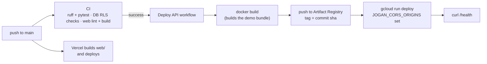

# Deployment

How the live system is put together, how a change reaches it, how it is watched, and how to rebuild it in your own accounts. Decisions: D-022 (walking skeleton), D-024 (API guards), D-026 (monitoring and keep-alive).

## 1. What runs where

| Part | Host | Region | Address | Deployed by |
|---|---|---|---|---|
| Web app (`web/`) | Vercel, project `jogan-bd`, root `web/` | Vercel's edge | <https://jogan-bd.vercel.app> | Vercel on every push to `main` |
| API (`jogan/api`) | Google Cloud Run, service `jogan-api` | `asia-southeast1` (Singapore) | <https://jogan-api-gt7msysppq-as.a.run.app> | `.github/workflows/deploy-api.yml` after CI passes |
| API images | Artifact Registry, repository `jogan` | `asia-southeast1` | — | the same workflow; the 3 newest images are kept |
| Database and sign-in | Supabase (Free plan) | Singapore | project URL in Secret Manager | migrations in `supabase/migrations/` |
| Secrets | Google Secret Manager | — | — | `scripts/gcp-setup.sh`, from the owner's `.env` |
| Gemini | Google AI Studio (free tier, billing off) | — | — | API key in Secret Manager |

The API and the database sit in the same region. Cloud Run runs at most 2 instances (1 vCPU, 1 GiB each, scale to zero, CPU boost on start). The API is public at the network level because it verifies every Supabase token itself; CORS answers only `https://jogan-bd.vercel.app`.

## 2. From a push to production

- **CI** (`.github/workflows/ci.yml`): Python lint and tests (`make lint`, `make test`), the database checks (`scripts/test-db.sh` on Postgres 17), and the web app's lint and production build on Node 22.
- **API deploy** (`.github/workflows/deploy-api.yml`): runs only when CI succeeded on `main` (or by hand). It signs in to Google Cloud **without a stored key**, through Workload Identity Federation that trusts only this repository's `main` branch. The deployer account may only push images, deploy revisions and act as the runtime account `jogan-api`. The image is tagged with the commit sha, so each revision maps to one commit. Docker layers are cached between runs.
- **The image** (`Dockerfile`): `python:3.12-slim-trixie`, dependencies from `uv.lock`, then `python -m jogan.api.bundle --profile full --seed 42` builds the served bundle inside the image. No model or data file is in git (D-002 #7). It runs as a non-root user with `JOGAN_ENV=production` and `JOGAN_TRUSTED_PROXY_HOPS=1`.
- **Web**: Vercel builds `web/` with the `NEXT_PUBLIC_*` variables set in the Vercel project and deploys on every push.
- **Database changes** are not automatic: a new migration is applied by the owner (section 4), then the API that needs it is pushed.

## 3. Secrets and settings

| Value | Lives in | Read by |
|---|---|---|
| `SUPABASE_URL`, `SUPABASE_PUBLISHABLE_KEY`, `SUPABASE_SECRET_KEY`, `GEMINI_API_KEY` | Secret Manager (`supabase-url`, `supabase-publishable-key`, `supabase-secret-key`, `gemini-api-key`) | only the runtime account `jogan-api`, as env vars of the Cloud Run service |
| `JOGAN_CORS_ORIGINS` | the deploy workflow (`WEB_ORIGIN`), so it is in git | the API |
| `GCP_WIF_PROVIDER`, `GCP_DEPLOY_SA` | GitHub repository variables (not secrets: they are identifiers) | the deploy workflow |
| `NEXT_PUBLIC_API_BASE_URL`, `NEXT_PUBLIC_SUPABASE_URL`, `NEXT_PUBLIC_SUPABASE_PUBLISHABLE_KEY`, `NEXT_PUBLIC_DEMO_PASSWORD` | Vercel project settings | the web build (public by nature) |
| `JOGAN_DEMO_PASSWORD` | the owner's `.env` | `scripts/seed_demo_users.py` |

The secret key never reaches the browser. The demo password is public on purpose so judges can sign in with one click (D-022); the accounts only see simulated data and every decision is audited. gitleaks runs in pre-commit and in CI.

## 4. Rebuilding it in your own accounts

Commands are for bash; the owner's fish shell needs `set -x NAME value` instead of `export`.

1. **Supabase.** Create a project (Singapore). Apply the migrations in order, with the Supabase CLI (`supabase link --project-ref <ref>`, then `supabase db push`) or by running each file of `supabase/migrations/` in the SQL editor. In Authentication, turn public sign-up off. Put the URL and the publishable and secret keys in `.env`, set `JOGAN_DEMO_PASSWORD`, then run `uv run --env-file .env python scripts/seed_demo_users.py` to create `jogan.analyst@example.com` and `jogan.approver@example.com` with their roles.
2. **Gemini.** Create a key in Google AI Studio (do not enable billing) and put it in `.env` as `GEMINI_API_KEY`. Optional: without it, rewording falls back to the template.
3. **Google Cloud.** Create a project with billing and a budget alert, and install `gcloud`, `gh` and Docker, logged in to both CLIs. The setup script does not do the following, so do it first: enable the Cloud Run, Artifact Registry, Secret Manager, IAM, IAM Service Account Credentials and Security Token Service APIs; create a Docker repository `jogan` in Artifact Registry (`asia-southeast1`); create the service accounts `jogan-api` (runtime) and `jogan-deployer`; and push a first image tagged `bootstrap` (`docker build -t asia-southeast1-docker.pkg.dev/<project>/jogan/api:bootstrap .`, then `docker push` it), or set `IMAGE=` to an image you pushed. Edit the project id, project number and repository at the top of `scripts/gcp-setup.sh` and of `.github/workflows/deploy-api.yml`, then run `bash scripts/gcp-setup.sh` from the repo root. It copies the four secrets into Secret Manager, sets up keyless deploys and the image clean-up, makes the first Cloud Run deploy, and stores the two GitHub variables. It is safe to re-run.
4. **Vercel.** Import the repository, set the root directory to `web/`, add the `NEXT_PUBLIC_*` variables (API URL from step 3), and deploy. Put the Vercel address in `WEB_ORIGIN` in the deploy workflow.
5. **Push to `main`.** CI runs, then the API is rebuilt and deployed.

## 5. Checking a deploy

- `curl https://jogan-api-gt7msysppq-as.a.run.app/health` → `{"status": "ok", ...}`; `/health/db` also runs one database query.
- `uv run --with playwright python scripts/live_check.py` drives the live site in Chrome: the public impact page, the map, the analyst refused a decision (403), the interface in Bangla, Gemini's rewording, an approval and a rejection audited, the 8-step trace, a forged token (401), a malformed date (422), the rate limit with forged `X-Forwarded-For`, CORS and `/health/db`. It decides two visits on the live database.

## 6. Monitoring and keep-alive

- **Health routes.** `GET` or `HEAD` `/health` (the process) and `/health/db` (one PostgREST query with the secret key, answer reused for 60 s, 503 if the database fails).
- **Uptime monitor.** UptimeRobot (free plan) checks `/health/db` and the web app's `/about` every 5 minutes and emails the owner. This is on the owner's checklist in [`STATUS.md`](STATUS.md).
- **Keep-alive.** A free Supabase project pauses after a week without database activity. The uptime monitor's calls to `/health/db` keep it active; `.github/workflows/keepalive.yml` calls the same route every 6 hours as a backup that needs no outside account.
- **Logs.** Cloud Run request and application logs in Google Cloud Logging; Vercel's deployment and function logs; GitHub Actions run history for CI, deploys and the keep-alive.

## 7. Rolling back

- **API:** route traffic back to an earlier revision, `gcloud run services update-traffic jogan-api --to-revisions <revision>=100 --region asia-southeast1`, or re-run the deploy workflow on an earlier commit.
- **Web:** promote an earlier deployment in the Vercel dashboard.
- **Database:** migrations only add; there is no down migration. The audit log cannot be edited by design, so a bad decision is corrected by a new decision on a new plan, not by changing history.

## 8. Cost and end of life

Everything runs on free tiers except Cloud Run and Artifact Registry, which bill to the owner's Google Cloud project under a budget alert; scale to zero keeps idle cost near nothing. The live demo stays up until about 15 Oct 2026. After that: delete the UptimeRobot monitors and `.github/workflows/keepalive.yml`, delete the Cloud Run service and images, and pause or delete the Supabase project.
